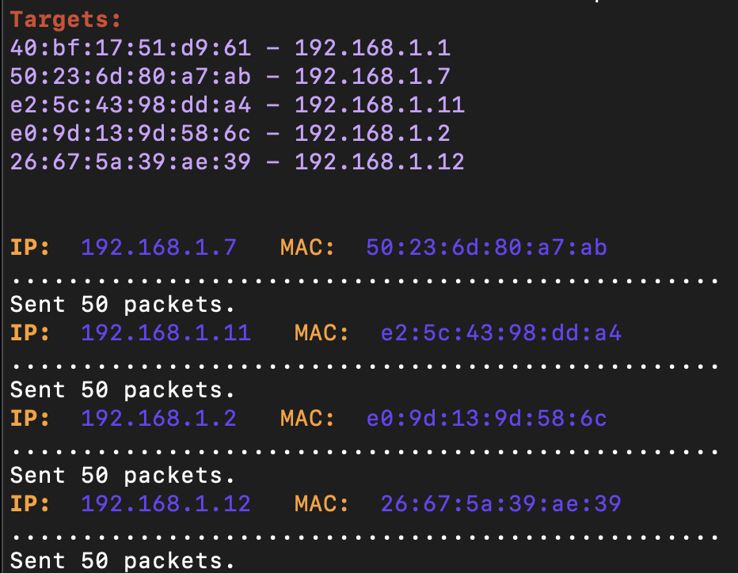

# deauth espresso machine ☕

```
$ sudo deauth_espresso.py --help
usage: deauth_espresso.py [-h] [-c COUNT] [--inter INTER] [--attack-inter ATTACK_INTER] [-i IFACE] [-si SCAN_IFACE] [-v] bssid

free the coffeshop wifi for yourself

positional arguments:
  bssid                 bssid of target network address

options:
  -h, --help            show this help message and exit
  -c COUNT, --count COUNT
                        number of deauthentication frames to send per target, default is 20
  --inter INTER         sending frequency between frames, default is 20ms
  --attack-inter ATTACK_INTER
                        round robin frequency, default is 5s
  -i IFACE              deauth interface, must be in monitor mode
  -si SCAN_IFACE        scanning interface
  -v, --verbose

```

## example 
```sh
$ sudo python deauth_espresso.py --inter 0.005 -c 50 -i en0 -v  40:bf:17:51:d9:61
```


